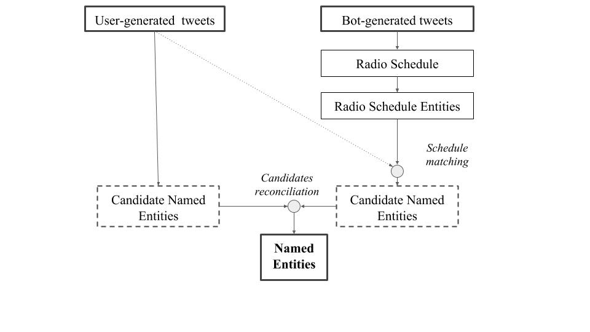
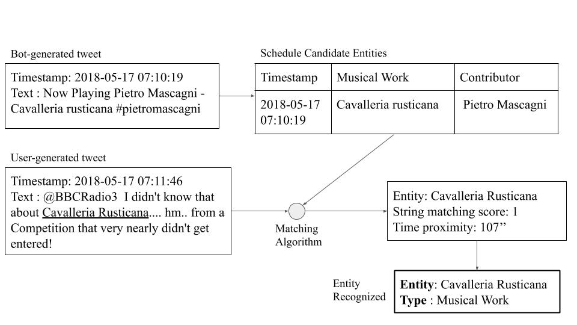

# Recognizing Musical Entities in User-generated Content

We present a novel method for detecting musical entities from user-generated content, modelling linguistic features with statistical models and extracting contextual information from a radio schedule.  We analyzed tweets related to a classical music radio station, integrating its schedule to connect users' messages to tracks broadcasted. 

This repository contains code to reproduce the results of our [arXiv paper](https://arxiv.org/abs/1904.00648).

    <i>Overview of the Named Entity Recognition System proposed</i>
    

  <i>Example of the workflow for recognizing entities in user-generated content using the information from the radio schedule</i>
  

#### Reference:
> Lorenzo Porcaro, Horacio Saggion (2019). Recognizing Musical Entities in User-generated Content. Paper presented at the International Conference on Computational Linguistics and Intelligent Text Processing (CICLing) 2019, University of La Rochelle, La Rochelle, 7-13 April.

## Reproduce our results

#### Installation:
Create a python 2.7 (sorry!) virtual environment and install dependencies `pip install -r src/requirements.txt`

#### Update config file:
Update the file `etc/config.yaml`, insert your consumer key, consumer secret, access token, access secret from the Twitter API. More info about the API: https://developer.twitter.com/

#### Import data:
To receive the data for reproducing the experiment, please contact `lorenzo.porcaro at gmail.com`. Once received, go to the data [README](https://github.com/LPorcaro/musicner/tree/master/data) page for more info.

#### Pre-process data:
To pre-process the data, run:

`python src/hydrate_tweet.py -i ../path/to/input/file.json`

It will read the tweet IDs and related annotations from the input file, and create the following output files
1) **INPUTFILE_entities.csv**: list of entities annotated
2) **INPUTFILE_summary.csv**: tweets summary information (creation date, raw text, etc)
3) **INPUTFILE_text_tkn.txt**: tweet raw texts tokenized

#### Extract features:
To extract the required features from the data, run:

`python src/extract_features.py -i ../path/to/INPUTFILE_summary.csv -e ../path/to/INPUTFILE_entities.csv -o ../path/to/OUTPUTFILE_WEKA.csv -n ../path/to/OUTPUTFILE_biLSTM_CRF.csv`

It extracts several features from the input tweets for performing the experiments. It takes as input the **INPUTFILE_summary.csv** and **INPUTFILE_entities.csv**, and it creates two output files: one which can be used as input in WEKA, and one which can be used as input in BiLSTM-CNN-CRF architecture for sequence tagging implementation https://github.com/UKPLab/emnlp2017-bilstm-cnn-crf

#### Schedule  matching:
To run the matching against the schedule, run

`python src/schedule_matcher.py -w work_tsl -c contr_tsl -t time_tsl -i ../path/to/UGC_INPUTFILE_summary.csv -s ../path/to/SCHEDULE_INPUTFILE_summary.csv`

It searches for matches between entities annotated in the schedule and  user-generated tweets. It writes the results in a text file in CoNLL format. The input parameters are the input summary files and the thresholds:
- time_tsl (int): time-distance threshold (in seconds) between schedule tweet and user-generated tweet
- work_tsl (float): string similarity thresholds for Musical Work entities
- contr_tsl (float): string similarity thresholds for Contributor entities

The output file is written in `results/schedule_matcher_%s_%s_%s.txt`, where the %s in the file path are the values used for the thresholds. 

For evaluating the results obtained from the schedule matching, run 

`src/conlleval < results/schedule_matcher_%s_%s_%s.txt > results/score.schedule_matcher_%s_%s_%s.txt`
